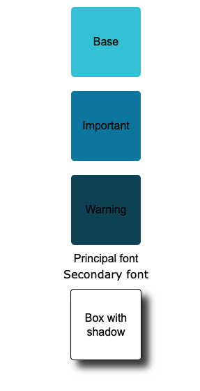
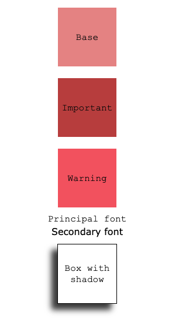

# Module: Layout-01 Basic - Exercise: 2

Use two distinct themes using CSS variables to change the color, font, border radius, and box shadow of the elements.

The theme changes affect the following features:

- Color
- Font
- Border radius
- Box shadow

To visualize the changes, import one theme or the other in the main stylesheet file.

## Instructions

This project use `vite` as a build tool. You can run the project with the following commands:

```bash
npm install
npm run dev
```

Then you can open your browser and navigate to `http://localhost:xxxx` to see the project.

## Devcontainer

This project includes a `devcontainer.json` file that allows you to use Visual Studio Code's Remote - Containers extension to develop in a containerized environment. To use it, you need to have Docker and the Remote - Containers extension installed in Visual Studio Code.

### Install Docker

You can download Docker from the following link: [Docker](https://www.docker.com/products/docker-desktop)

### Install Remote - Containers extension

You can download the Remote - Containers extension from the following link: [Remote - Containers](https://marketplace.visualstudio.com/items?itemName=ms-vscode-remote.remote-containers)

### Open the project in a container

1. Clone the repository

2. Open the project in Visual Studio Code

3. Click on the green icon in the bottom left corner of the window

4. Click on `Reopen in Container`

5. Wait for the container to build

6. You can now use the project in a containerized environment

7. Follow the instructions in the README.md file to run the project

## Test

When you run for the first time, your project should look like the following image:



Go to `styles.css` and change the line `@import url('./color-theme-1.css');` to `@import url('./color-theme-2.css');` . Your project should look like the following image:

